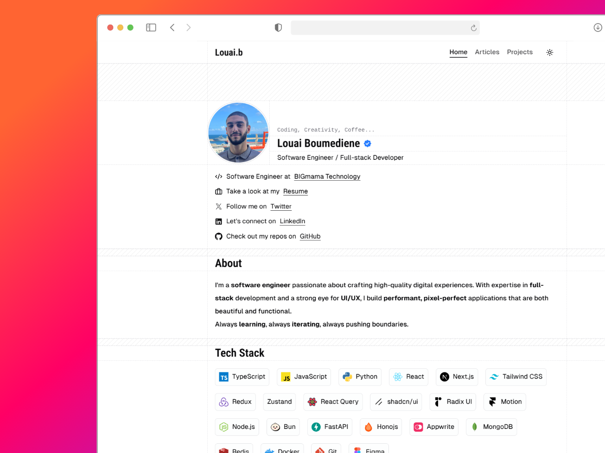

# Babatunde Portfolio Website



## 🌟 Overview

A modern, responsive portfolio website built with **Astro**, **React**, **TypeScript**, and **TailwindCSS**. This website showcases professional experience, projects, articles, and certifications with smooth animations and excellent performance.

## ✨ Features

- 🌙 **Light & Dark Mode** – Seamless theme switching with user preference persistence
- 📱 **Fully Responsive** – Optimized for all device sizes
- 📖 **Blog System** – MDX-powered articles with automatic table of contents and pagination
- 🏷️ **Content Organization** – Categorized articles and project filtering
- 🚀 **Project Showcase** – Detailed project pages with images, tech stacks, and live demos
- 📄 **Certifications Section** – Professional certifications and achievements
- 💼 **Experience Timeline** – Professional work history and positions
- 🎨 **Modern Design** – Clean, minimalistic interface with smooth animations
- 🔍 **SEO Optimized** – Meta tags, Open Graph images, and search engine friendly
- ⚡ **Performance First** – Built with Astro for lightning-fast loading

## 🛠️ Tech Stack

- **[Astro](https://astro.build/)** - Static site generator
- **[React](https://reactjs.org/)** - UI components
- **[TypeScript](https://www.typescriptlang.org/)** - Type safety
- **[TailwindCSS](https://tailwindcss.com/)** - Styling framework
- **[Framer Motion](https://www.framer.com/motion/)** - Animations
- **[MDX](https://mdxjs.com/)** - Enhanced markdown
- **[Bun](https://bun.sh/)** - Package manager and runtime

## 🚀 Quick Start

### Prerequisites
- **Bun** (recommended) or Node.js 18+
- Git

### Installation

1. **Clone the repository**
   ```bash
   git clone https://github.com/kitjack/babatunde-portfolio.git
   cd babatunde-portfolio
   ```

2. **Install dependencies**
   ```bash
   bun install
   ```

3. **Start development server**
   ```bash
   bun run dev
   ```

4. **Open your browser**
   Navigate to `http://localhost:4321`

### Build for Production

```bash
# Build the site
bun run build

# Preview the build
bun run preview
```

## 📁 Project Structure

```
├── public/                 # Static assets
│   ├── favicon.svg
│   ├── og-images/         # Open Graph images
│   └── screenshots/
├── src/
│   ├── components/        # Reusable UI components
│   ├── content/          # Blog posts and projects (MDX)
│   ├── data/             # Content data files
│   ├── layouts/          # Page layouts
│   ├── lib/              # Utilities and constants
│   ├── pages/            # Astro pages and routes
│   └── styles/           # Global CSS styles
├── astro.config.mjs      # Astro configuration
├── tailwind.config.mjs   # Tailwind configuration
├── tsconfig.json         # TypeScript configuration
└── package.json          # Dependencies and scripts
```

## 🎨 Customization

### Personal Information
Update personal details in:
- `src/lib/constants/profile.ts` - Basic profile information
- `src/lib/constants/experience.ts` - Work experience and positions
- `src/lib/constants/certifications.ts` - Professional certifications
- `src/lib/constants/tech-stack.ts` - Skills and technologies

### Content
- **Blog Posts**: Add new articles in `src/data/blog/` as `.mdx` files
- **Projects**: Add projects in `src/data/projects/` as `.mdx` files
- **Images**: Replace images in `public/` and `src/assets/`

### Styling
- **Colors**: Modify the color palette in `tailwind.config.mjs`
- **Global Styles**: Edit `src/styles/global.css`
- **Component Styles**: Update individual component files

## 📝 Content Management

### Adding Blog Posts
1. Create a new `.mdx` file in `src/data/blog/`
2. Add frontmatter with title, description, date, category, etc.
3. Write your content using Markdown and JSX components

### Adding Projects
1. Create a new `.mdx` file in `src/data/projects/`
2. Include project details in frontmatter
3. Add project description and technical details

## 🌐 Deployment

The site can be deployed to various platforms:

- **Netlify**: Configure build command as `bun run build` and publish directory as `dist`
- **Vercel**: Automatic deployment with GitHub integration
- **GitHub Pages**: Use GitHub Actions for deployment
- **Any static host**: Build locally and upload the `dist` folder

## 📊 Performance

- **Lighthouse Score**: 100/100 in Performance, Accessibility, Best Practices, and SEO
- **Core Web Vitals**: Optimized for LCP, FID, and CLS
- **Bundle Size**: Minimal JavaScript with Astro's partial hydration

## 🤝 Contributing

Contributions are welcome! Please feel free to submit a Pull Request.

1. Fork the repository
2. Create your feature branch (`git checkout -b feature/AmazingFeature`)
3. Commit your changes (`git commit -m 'Add some AmazingFeature'`)
4. Push to the branch (`git push origin feature/AmazingFeature`)
5. Open a Pull Request

## 📄 License

This project is open source and available under the [MIT License](LICENSE).

## 🙏 Acknowledgments

- Original template by [Louai Zokerburg](https://github.com/Louai-Zokerburg/louai)
- Built with [Astro](https://astro.build/)
- Styled with [TailwindCSS](https://tailwindcss.com/)
- Animations powered by [Framer Motion](https://www.framer.com/motion/)

---

Made with ❤️ by Babatunde | [Portfolio](https://same-pq2zsq5i2z4-latest.netlify.app) | [GitHub](https://github.com/kitjack)